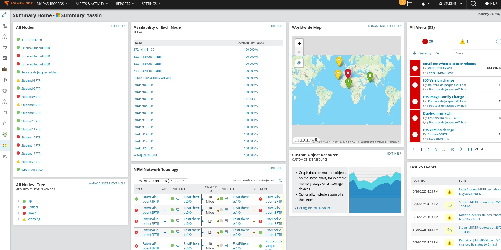

# Network Performance Monitoring Lab

**Lab 2 – SolarWinds & NetPath**  
This lab demonstrates the deployment of an enterprise-grade network monitoring setup using [SolarWinds Network Performance Monitor (NPM)](https://www.solarwinds.com/network-performance-monitor) and NetPath to visualize, monitor, and alert on key performance metrics between a Windows probe and a Cisco router.

## Overview

The goal of this lab was to:
- Deploy a Windows-based probe to monitor a Cisco router.
- Set up SNMP-based discovery and interface monitoring.
- Use NetPath to visualize the network path and latency.
- Configure real-time alerts on performance degradation.
- Customize a monitoring dashboard for centralized observability.

All of this was done using SolarWinds Platform 2025.1.1 in a secure lab environment.

---

## Lab Topology

The monitoring architecture consisted of:
- **Probe:** Windows host `WIN-IJ32H3IRSVU`
- **Target Device:** Cisco router `Student11RTR` – IP `172.16.111.1`
- **Platform:** SolarWinds NPM 2025.1.1 (Self-hosted)

---

## NetPath Visualization

NetPath was configured to trace TCP connectivity to the router on port 23, allowing full visibility into the intermediate hops, latencies, and availability variations.


---

## Custom Dashboard

A dedicated summary dashboard (`Summary_Yassin`) was built to centralize key data:
- Node availability
- Network topology
- World map location view
- Custom latency graphs



---

## Alerting System

Two alert rules were configured to notify the administrator in case of high response time or unexpected behavior. These alerts help automate detection of degradation and reduce response time to incidents.


---

## English Report

A complete PDF report documenting the project methodology, screenshots, and technical explanations is available [here](./report/TP_Solarwinds.pdf).

---

## Key Takeaways

This lab exercise simulates realistic enterprise monitoring scenarios and demonstrates:
- Proficiency with SolarWinds NPM
- SNMP configuration and interface import
- End-to-end network path visualization
- Automation of alert workflows
- Dashboard creation for NOC-style observability

---

## Technologies Used

| Tool        | Version         |
|-------------|------------------|
| SolarWinds NPM | 2025.1.1        |
| Windows Probe | Windows 10/11    |
| Cisco IOS    | Cisco 3640        |

---

## Repository Structure

```
├── assets/                 # Screenshots used in the README
│   ├── netpath.png
│   ├── dashboard.png
│   └── alerts.png
│
└── report/
    └── TP_Solarwinds.pdf   # Full technical report (in English)
```
